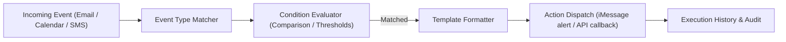

# genpark-messaging-recipe-automation-workflow-skill

> Declarative Recipe Automation Engine for Messaging Personal Agents. 100% Python Standard Library.

Distilled from **Poke**'s signature "Recipes" architecture, allowing users to express natural language automations as reactive event-condition-action pipelines without needing complex code.

## Architecture

## Features
- **Zero-Dependency Engine**: Pure Python 3 rule evaluation.
- **Templated String Interpolation**: Seamlessly hydrates event data into customized notification messages.
- **Execution Audit Log**: Tracks invocation timestamps, parameters, and action results.
